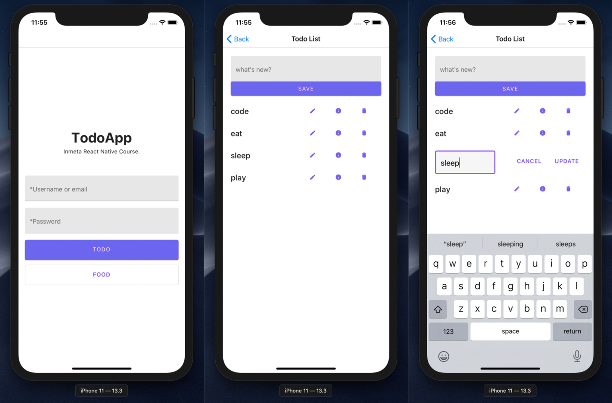

# React Native, Hooks, Redux, Saga, Thunk, TypeScript

### To run the project

```sh
$ git clone https://github.com/webmasterdevlin/react-native-redux-typescript.git
$ cd react-native-redux-typescript
$ yarn install
$ yarn run backend
$ yarn run start:ios
```


